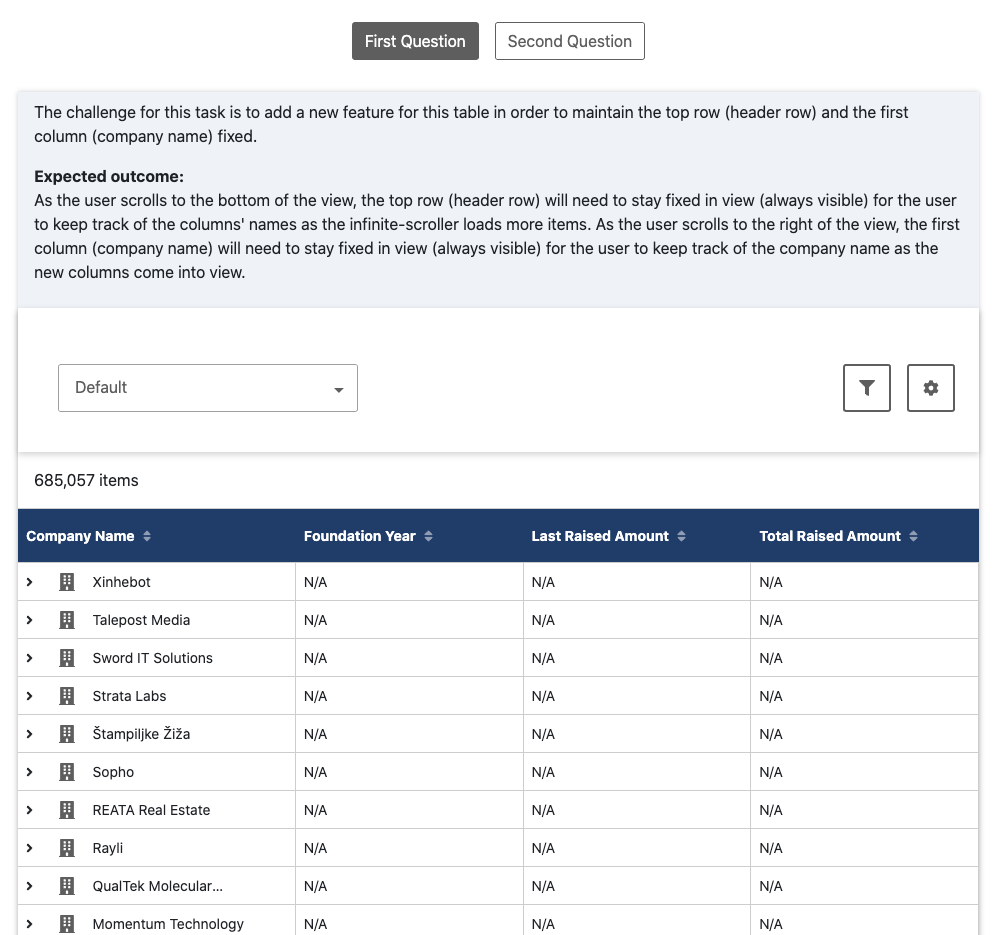
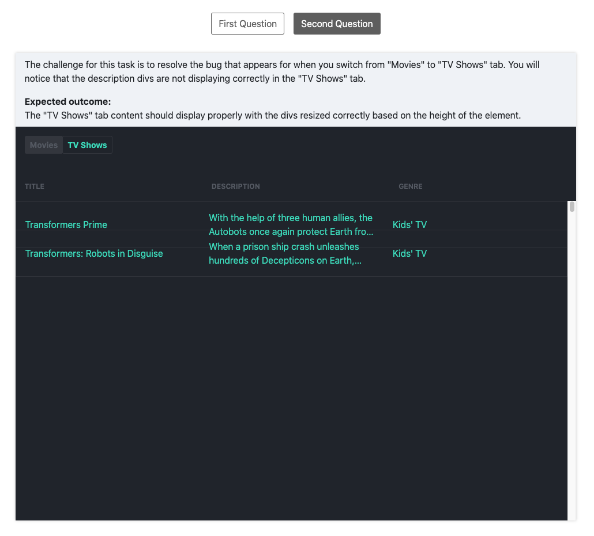

# vuejs-candidates-test

## Project setup

Fork this repository to your GitHub account.

Clone this repository to your local environment and run the following:

```
npm install
```

### Starting the project

To start the project, navigate to your local repository, and run:

```
npm run serve
```

Once the project has completed starting, you will see:

```
App running at:
- Local: http://localhost:8080/
- Network: http://xxx.xxx.xx.xx:8080/
```

## Starting the interview test

There will be 2 questions for this interview test.

### First question

The challenge for this task is to add a new feature for the table shown in `First Question` tab. 

This new feature will maintain the top row (header row) and the first column (company name) fixed. See below for screenshot:



#### Expected outcome

As the user scrolls to the bottom of the view, the top row (header row) will need to stay fixed in view (always visible) for the user to keep track of the columns' names as the infinite-scroller loads more items. 

As the user scrolls to the right of the view, the first column (company name) will need to stay fixed in view (always visible) for the user to keep track of the company name as the new columns come into view.

### Second question

In the `Second Question` tab, the challenge is to resolve the bug that is visible in the "TV Shows" table after switching from "Movies" (first tab) to "TV Shows" (second tab).

You will notice that there are only a few items displayed **incorrectly** in the "TV Shows" tab, and that it's missing the rest of the items for "TV Shows". See below for screenshot:



After your first scroll in the "TV Shows" table section, the view in the table resets back to normal. 

To see the error again, refresh the page and switch back to the "TV Shows" tab.

#### Expected outcome

The "TV Shows" tab content should display properly with all the items shown at initial load with the correct height of the elements in each row.

## Completing the interview test

Once the alloted time is up, create a branch titled `interview_test_first_name_last_name_initial` for all your work, **finished or not**, and send your GitHub's branch link to us for review.

An example for a branch title would be `interview_test_john_d`.

We will be in touch shortly after.

Best of luck!
